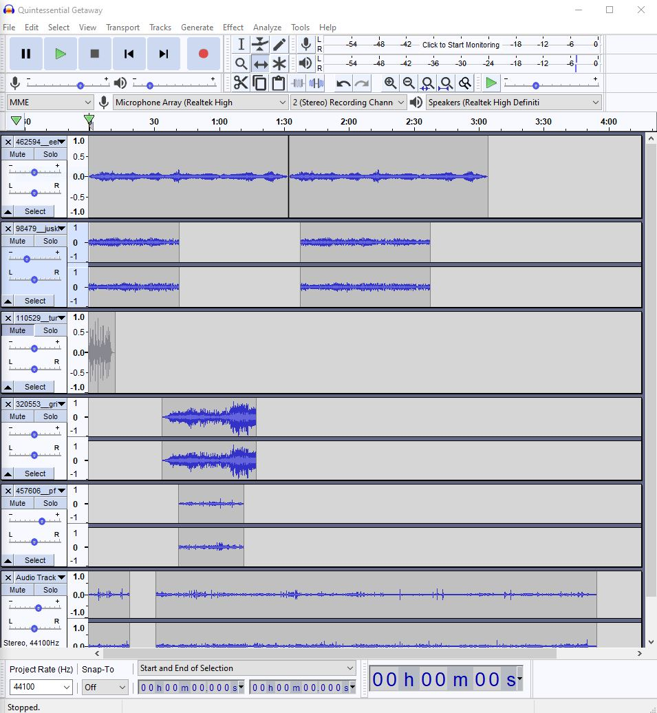

<b><u>February 6th, 2021 02:03PM</u></b>

At this point in my project I began to record some of the sounds that I will be using in the full draft. The introduction to my project will be a student (me) on the computer participating in a boring zoom class. All of the classes are catching up to the student and they are beginning to feel overwhelmed. Luckily, on this day it is a Friday. The student gains some inspiration to treat themselves to a "Quintessential Getaway". They will be entering a vehicle and driving to the beach from this point on. I am still not sure how to signal that they decide to go to the beach, but as I continue digging into the project I may find a way to do this. I recorded all of the sounds from the Voice Memo app on my iPhone. When I originally tried to insert them into audacity I received this error:

Eventually after looking online, I found a way to convert from the standard Apple .m4a sound file to .wav using itunes from this
<a href="https://www.youtube.com/watch?v=_HNwOznavWY"> youtube </a>
video.

<b><u>February 4th, 2021 02:00PM</u></b>

In the latest version of my soundscape project, I have developed the baseline of my narrative. The first thing that I had to do was figure out a name for the project. Since the theme of my project is about the beach, I obviously wanted something that was along the lines of a vacation. Some trips we take to the beach can be quite spontaneous. I ultimately ended up at the name "Quintessential Getaway". This is one of those vacations where you just really needed to get away for a weekend or so. I believe that all of these sounds used thus far were sourced from <a href="https://freesound.org/">freesound.org</a>. Obviously one of the first sounds that I needed to find was the waves crashing down on the shore. I was able to find a very consistent and delicate sound that aligned with the tranquility theme of my soundscape. The next sound I found was the sound of seagulls chirping about in a flock. To add some depth to my project I wanted to incorporate a group of people coming onto the beach. These people would be the louder group of people that are drinking and playing EDM on a large boombox. I did not want these people to sound like they were right next to where I was on the beach. The sound for the boombox I found was quite muffled and distorted. I also was able to find a sound for a group of people outside drinking and laughing (which was perfect). Eventually I would like to add the sounds of unpacking my car and walking across the beach. When I find the right spot on the beach I will be unfolding my towel and applying sunscreen. Also, I really want a Tiki bar scene where I can go up and order a pina colada.

